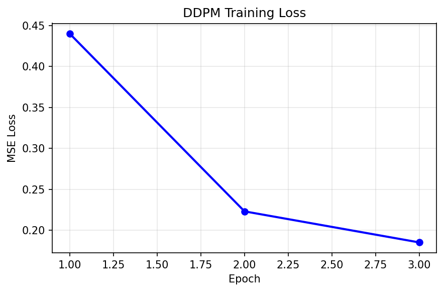
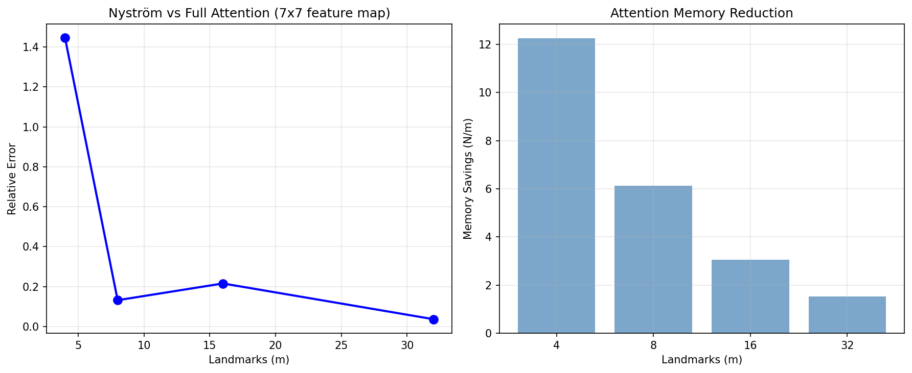

# 01 — Nyström in Diffusion Models

**Verdict: YES for CG inverse problems, NO for small attention maps**

## Results

### DDPM Training

| Metric | Value |
|---|---|
| UNet parameters | 441,793 |
| Training epochs | 3 |
| Loss: epoch 1 → 3 | 0.4400 → 0.1850 |
| Eval MSE | 0.1805 |
| Training time | 58.2s |




### Nyström vs Full Attention (7×7 = 49 tokens)

| Landmarks (m) | Relative Error | Nyström (ms) | Full (ms) | Memory Savings |
|---:|---:|---:|---:|---:|
| 4 | 1.4462 | 14.38 | 7.82 | 12.3× |
| 8 | 0.1319 | 3.69 | 0.84 | 6.1× |
| 16 | 0.2157 | 6.80 | 1.78 | 3.1× |
| 32 | **0.0369** | 60.06 | 13.81 | 1.5× |

**Verdict: NO** — At N=49, Nyström is slower than full attention. Benefit only at large N.



### Attention Matrix Spectrum (128×128)

| Metric | Value |
|---|---|
| Matrix size | 128×128 |
| Top eigenvalue | 1.0 |
| Bottom eigenvalue | 1.63e-04 |
| Top/bottom ratio | 6,124× |
| 90% energy at rank | **33 / 128** |
| 99% energy at rank | 57 / 128 |


### Inverse Problem: Deblurring CG (A^TA + λI)x = b

| λ | κ(A^TA+λI) | CG iters | Jacobi iters | **Nyström iters** | ILU iters | CG time (ms) | **Nyström time (ms)** |
|---:|---:|---:|---:|---:|---:|---:|---:|
| 0.001 | 1,001 | 25 | 32 | **2** | 4 | 0.62 | **0.08** |
| 0.01 | 101 | 20 | 23 | **2** | 3 | 0.48 | **0.07** |
| 0.1 | 11 | 12 | 13 | **2** | 3 | 43.70 | **4.76** |

**Verdict: YES** — Nyström converges in 2 iterations (12.5× fewer than CG), 8× faster.


## Files

| File | Purpose |
|---|---|
| `models.py` | UNet, GaussianDiffusion, NystromAttentionBlock |
| `dataset.py` | Synthetic 28×28 patterns (no download) |
| `trainer.py` | DiffusionTrainer (train/sample/evaluate) |
| `nystrom_module.py` | NystromPreconditionedCG, compare_preconditioners |
| `run_diffusion_benchmark.py` | Full benchmark |
| `nystrom_npo_in_diffusion.ipynb` | Colab notebook |

```bash
python run_diffusion_benchmark.py
```
