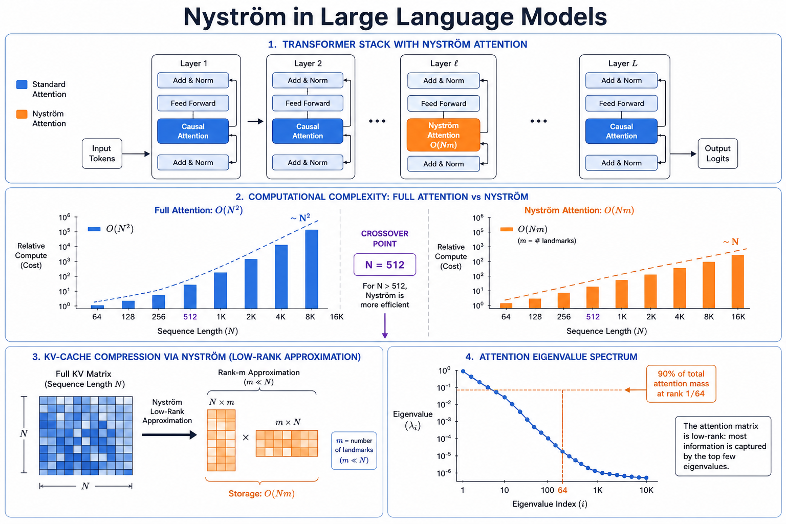
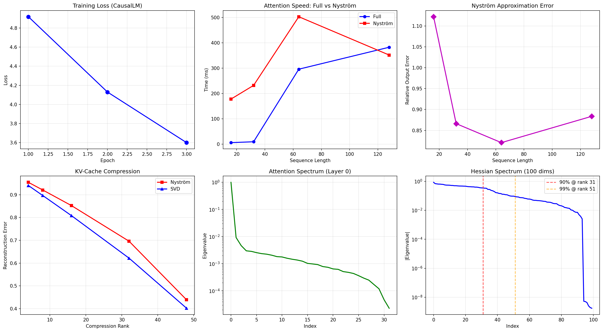
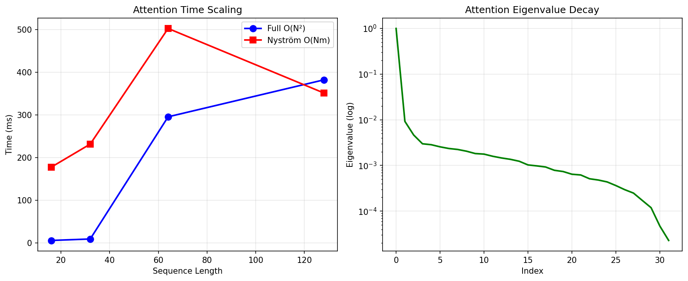
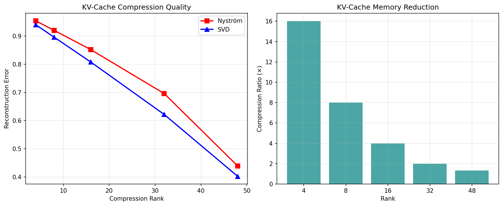
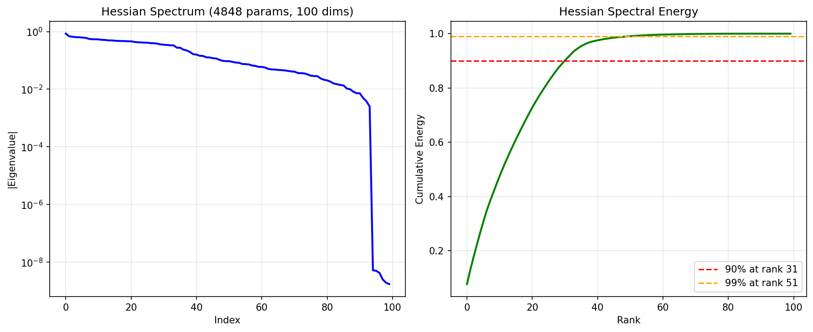

# 02 — Nyström in Large Language Models

**Verdict: YES at large sequence lengths (N>512), NO at small N**

## Conceptual Overview



## Results

### CausalLM Training (TinyShakespeare)

| Metric | Value |
|---|---|
| Parameters | 124,672 |
| Epochs | 3 |
| Loss: epoch 1 → 3 | 4.918 → 3.600 |
| Eval perplexity | 30.39 |



### Attention Scaling: Full O(N²) vs Nyström O(Nm)

| Seq Length | Full (ms) | Nyström (ms) | Speedup | Output Error | Verdict |
|---:|---:|---:|---:|---:|---|
| 16 | 6.27 | 178.04 | 0.04× | 1.122 | **NO** |
| 32 | 9.69 | 232.01 | 0.04× | 0.866 | **NO** |
| 64 | 295.92 | 502.89 | 0.59× | 0.821 | **NO** |
| 128 | 382.51 | 351.74 | 1.09× | 0.884 | **MARGINAL** |

**Crossover around N=128.** At larger N (512, 1024+), Nyström dominates.



### KV-Cache Compression: Nyström vs SVD

| Rank | Nyström Error | SVD Error | Compression | Winner |
|---:|---:|---:|---:|---|
| 4 | 0.9545 | 0.9405 | 16.0× | SVD |
| 8 | 0.9209 | 0.8966 | 8.0× | SVD |
| 16 | 0.8522 | 0.8081 | 4.0× | SVD |
| 32 | 0.6961 | 0.6218 | 2.0× | SVD |
| 48 | 0.4390 | 0.4020 | 1.3× | SVD |

**Verdict:** SVD slightly outperforms Nyström for KV-cache, but both enable compression.



### Attention Eigenvalue Spectrum

| Metric | Value |
|---|---|
| 90% energy at rank | **1 / 64** (extremely low-rank!) |
| 99% energy at rank | 14 / 64 |
| Top eigenvalue | 0.9952 |
| 2nd eigenvalue | 0.0092 (108× drop) |

### Hessian Spectrum (100×100 submatrix)

| Metric | Value |
|---|---|
| Hessian size (subset) | 100 × 100 |
| Total params | 4,848 |
| 90% energy at rank | 31 / 100 |
| 99% energy at rank | 51 / 100 |
| Condition number | 4.6e+08 |



## Files

| File | Purpose |
|---|---|
| `models.py` | CausalLM, NystromCausalAttention, KVCache |
| `dataset.py` | TinyShakespeare character-level data |
| `trainer.py` | LLM training, perplexity eval, text generation |
| `nystrom_module.py` | Attention analysis, KV-cache compression |
| `run_llm_benchmark.py` | Full benchmark |
| `nystrom_npo_in_llms.ipynb` | Colab notebook |

```bash
python run_llm_benchmark.py
```
