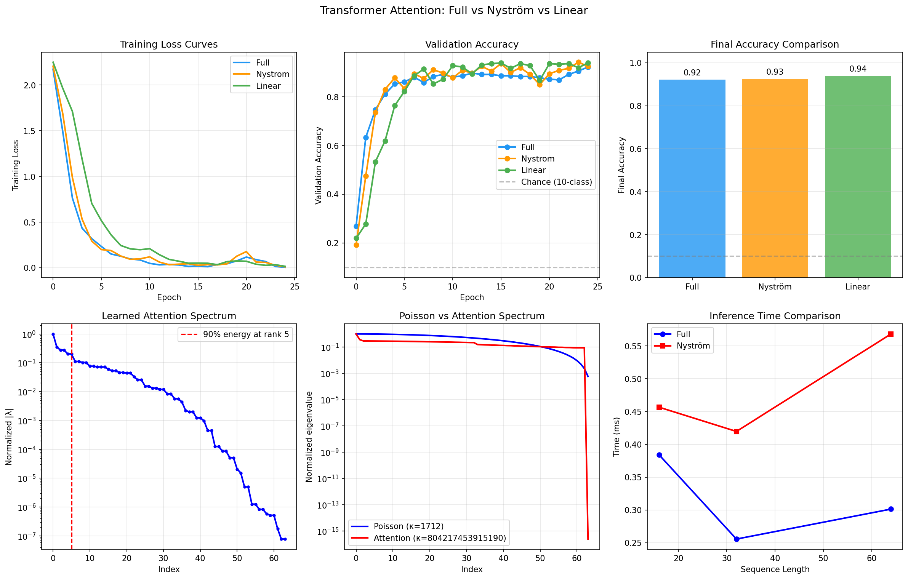

# 03 — Nyström Attention in Transformers

**Verdict: DEPENDS — same accuracy, speed only at large N**

## Results

### Classification Accuracy (25 epochs, sklearn digits)

| Model | Val Accuracy | Final Loss | Train Time (s) | Params |
|---|---:|---:|---:|---:|
| Full Attention | 92.2% | 0.0045 | 15.3 | 72,266 |
| Nyström Attention | 92.5% | 0.0106 | 9.9 | 72,266 |
| Linear Attention | **93.9%** | 0.0161 | **8.3** | 72,266 |

**Verdict:** All three achieve similar accuracy. Linear is fastest.

### Attention Output Comparison

| Metric | Value |
|---|---|
| Relative attention error (Full vs Nyström) | 1.210 |
| Mean logit difference | 131.7 |

### Attention Eigenvalue Spectrum

| Metric | Value |
|---|---|
| 90% energy at rank | **5 / 64** |
| Effective rank | 16.7 |
| Condition ratio | 1.28e+07 |

### Poisson vs Attention Spectrum

| Matrix | Condition Number |
|---|---|
| Poisson Laplacian (32×32 grid) | 1,712 |
| Attention matrix | 8.04e+14 |

Both have spectral structure, but attention is far more ill-conditioned.

### Inference Speed

| Seq Length | Full (ms) | Nyström (ms) | Speedup | Verdict |
|---:|---:|---:|---:|---|
| 16 | 0.384 | 0.457 | 0.84× | **NO** |
| 32 | 0.256 | 0.420 | 0.61× | **NO** |
| 64 | 0.301 | 0.568 | 0.53× | **NO** |

**Verdict:** At these small sequence lengths, Nyström overhead exceeds benefit.



## Files

| File | Purpose |
|---|---|
| `models.py` | TransformerClassifier (Full/Nyström/Linear attention) |
| `dataset.py` | Sklearn digits as 64-token sequences |
| `trainer.py` | Classification training + attention map extraction |
| `nystrom_module.py` | NystromAttentionAnalyzer |
| `run_transformer_benchmark.py` | Full benchmark |
| `nystrom_attention_mechanism.ipynb` | Colab notebook |

```bash
python run_transformer_benchmark.py
```
