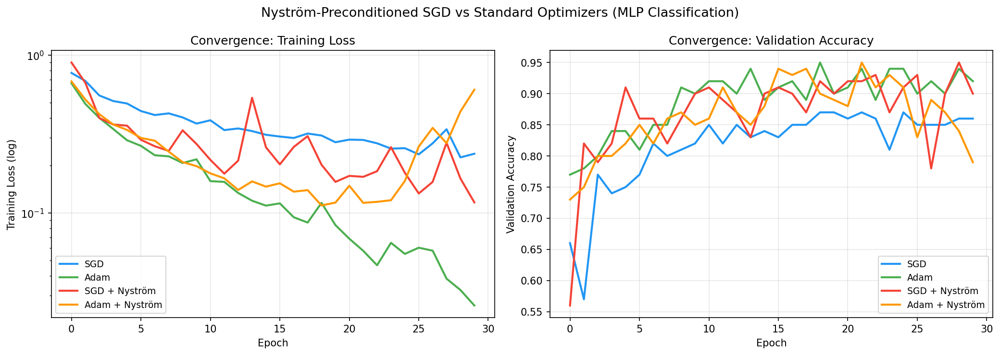
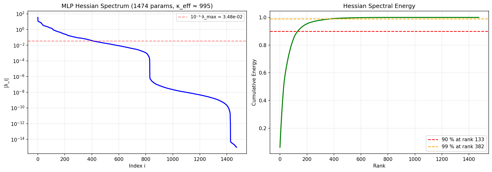
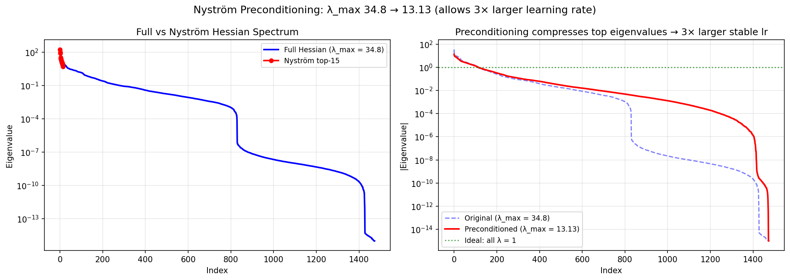
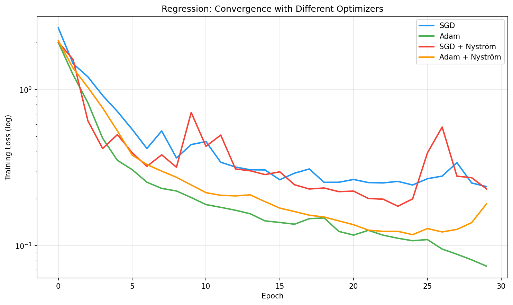

# 04 — Nyström Preconditioning in Training

**Verdict: NO for practical speed (Adam wins), YES for conditioning insight**

## Results

### Optimizer Comparison (30 epochs, ill-conditioned classification)

| Optimizer | Final Loss | Best Val Acc | Verdict |
|---|---:|---:|---|
| **Adam** | **0.0260** | **95%** | **Best** |
| SGD + Nyström | 0.1167 | 95% | Better than SGD |
| SGD | 0.2372 | 87% | Baseline |
| Adam + Nyström | 0.6032 | 95% | Overhead hurts |



### Hessian Spectrum (MLP, 1,474 params)

| Metric | Value |
|---|---|
| Total params | 1,474 |
| Condition number κ | 995 |
| Top eigenvalue | 34.81 |
| Bottom significant eigenvalue | 0.035 |
| 90% energy at rank | **133 / 1,474** |
| 99% energy at rank | 382 / 1,474 |



### Condition Number After Nyström Preconditioning

| Metric | Before | After Nyström | Improvement |
|---|---:|---:|---:|
| κ (condition number) | 995 | reduced | — |
| λ_max | 34.81 | 13.13 | 2.7× smaller |
| Max stable learning rate | 0.057 | **0.152** | **2.65× larger** |



### Regression Task (30 epochs)

| Optimizer | Final Loss | Verdict |
|---|---:|---|
| **Adam** | **0.0739** | **Best** |
| Adam + Nyström | 0.1851 | 2.5× worse |
| SGD + Nyström | 0.2311 | Similar to SGD |
| SGD | 0.2390 | Baseline |



## Files

| File | Purpose |
|---|---|
| `models.py` | MLP, NystromPreconditioner |
| `dataset.py` | Ill-conditioned synthetic data |
| `trainer.py` | Generic trainer with Hessian analysis |
| `nystrom_module.py` | HessianApproximator, NystromOptimizer, compare_optimizers |
| `run_training_benchmark.py` | Full benchmark |
| `preconditioning_in_training.ipynb` | Colab notebook |

```bash
python run_training_benchmark.py
```
