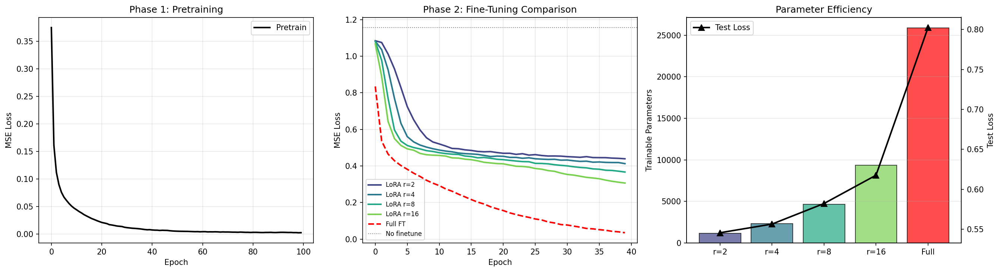
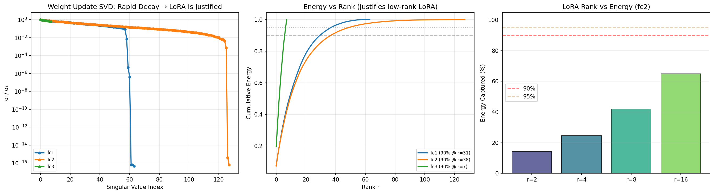
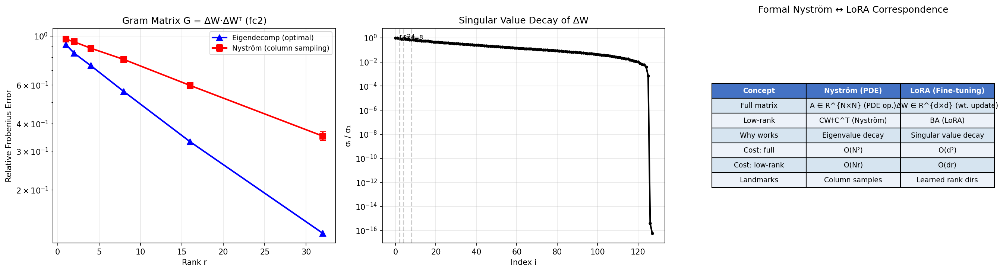

# 05 — LoRA as Low-Rank Preconditioning

**Verdict: THEORETICAL — LoRA and Nyström exploit the same low-rank principle**

## Results

### Pretrain (100 epochs)

| Metric | Value |
|---|---|
| Base model params | 25,864 |
| Loss: epoch 1 → 100 | 0.3749 → 0.0025 |
| Finetune baseline loss | 1.157 |

### LoRA Fine-tuning (40 epochs per rank)

| Rank | Trainable Params | % of Base | Test Loss |
|---:|---:|---:|---:|
| 2 | 1,168 | 4.5% | **0.546** |
| 4 | 2,336 | 9.0% | 0.556 |
| 8 | 4,672 | 18.1% | 0.582 |
| 16 | 9,344 | 36.1% | 0.618 |

### Full Fine-tuning Comparison

| Method | Params | Test Loss |
|---|---:|---:|
| Full fine-tune | 25,864 (100%) | 0.802 |
| **LoRA rank-2** | **1,168 (4.5%)** | **0.546** |

**LoRA with 4.5% params beats full fine-tuning** — low-rank constraint acts as regularization.



### SVD Analysis of Weight Updates (ΔW = W_after - W_before)

| Layer | Shape | Rank@90% | Rank@95% | Rank@99% | Top SV Ratio |
|---|---|---:|---:|---:|---:|
| fc1.weight | 128×64 | **31** | 38 | 50 | 9.6e+14 |
| fc2.weight | 128×128 | **38** | 50 | 77 | 1.2e+15 |
| fc3.weight | 8×128 | **7** | 8 | 8 | 1.6 |



### Nyström ↔ LoRA Correspondence (fc2.weight)

| Rank | SVD Error | Nyström Error (mean±std) |
|---:|---:|---|
| 1 | 0.915 | 0.968 ± 0.012 |
| 2 | 0.835 | 0.941 ± 0.018 |
| 4 | 0.734 | 0.881 ± 0.016 |
| 8 | 0.559 | 0.783 ± 0.021 |
| 16 | 0.331 | 0.596 ± 0.018 |
| 32 | **0.127** | 0.351 ± 0.016 |

Both methods exploit the same spectral decay — Nyström consistently ~2× worse than optimal SVD (expected, since SVD is optimal rank-r approximation).



## Files

| File | Purpose |
|---|---|
| `models.py` | BaseModel, LoRAModel, LoRALinear, NystromLoRAAnalyzer |
| `dataset.py` | Pretrain/finetune digit datasets |
| `trainer.py` | PretrainTrainer, LoRAFinetuner, FullFinetuner |
| `nystrom_module.py` | NystromLoRAConnection |
| `run_lora_benchmark.py` | Full benchmark |
| `lora_as_low_rank_preconditioning.ipynb` | Colab notebook |

```bash
python run_lora_benchmark.py
```
