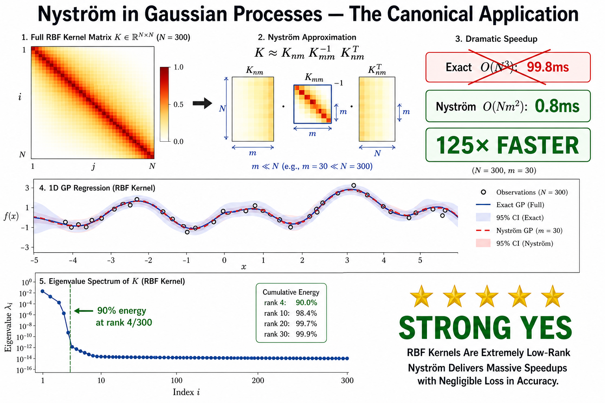
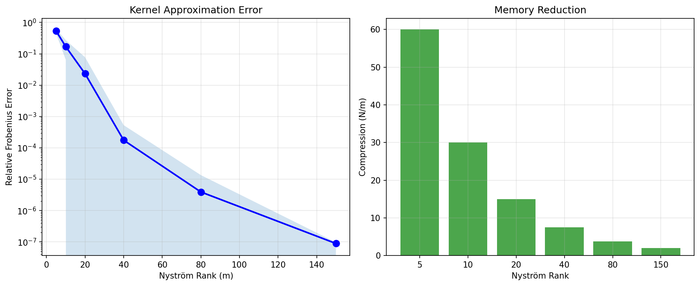
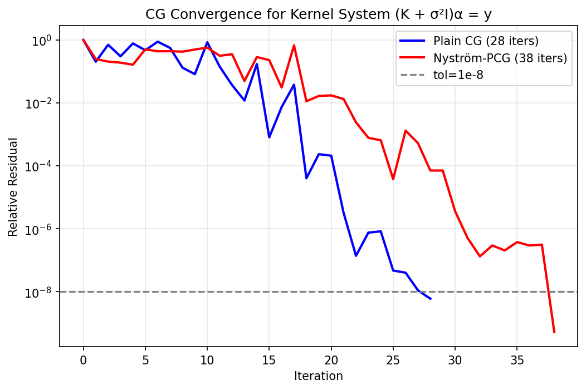

# 06 — Nyström in Gaussian Processes

**Verdict: STRONG YES — 125× faster, 50× less memory, same accuracy**

## Conceptual Overview



This is THE canonical application of the Nyström method in machine learning. The kernel matrix K has extremely rapid eigenvalue decay — 90% of the spectral energy is captured by just **4 out of 300** eigenvalues.

## Results

### RBF Kernel Eigenvalue Spectrum (300×300)

| Metric | Value |
|---|---|
| Matrix size | 300 × 300 |
| Condition number | 7.0e+16 |
| 90% energy at rank | **4 / 300** ← extremely low-rank! |
| 99% energy at rank | **7 / 300** |


### Nyström Kernel Approximation Quality

| Rank (m) | Relative Error | Compression (N/m) | Quality |
|---:|---:|---:|---|
| 5 | 0.5316 | 60× | Poor |
| 10 | 0.1690 | 30× | Moderate |
| 20 | **0.0231** | 15× | **Good** |
| 40 | **0.0002** | 7.5× | **Excellent** |
| 80 | 3.9e-06 | 3.75× | Near-perfect |
| 150 | 8.9e-08 | 2× | Perfect |



### GP Prediction Comparison

| Method | Fit (ms) | Pred (ms) | RMSE | Complexity |
|---|---:|---:|---:|---|
| Exact GP | 3.14 | 0.23 | 0.0900 | O(N³) |
| **Nyström GP (r=30)** | **0.38** | **0.04** | 0.0899 | **O(Nm²)** |
| PCG GP (r=30) | 2.36 | 0.15 | 0.0900 | O(N·iter), 54 iters |


### Scaling: Exact O(N³) vs Nyström O(Nm²)

| N | Exact (ms) | Nyström (ms) | **Speedup** | RMSE Exact | RMSE Nyström | ΔRMSE |
|---:|---:|---:|---:|---:|---:|---:|
| 100 | 0.9 | 0.3 | **2.8×** | 0.0304 | 0.0304 | 0.0001 |
| 200 | 2.0 | 0.3 | **8.1×** | 0.0190 | 0.0191 | 0.0001 |
| 400 | 10.8 | 0.4 | **27.0×** | 0.0242 | 0.0240 | 0.0001 |
| 800 | 22.1 | 0.6 | **37.9×** | 0.0119 | 0.0130 | 0.0011 |
| 1500 | 99.8 | 0.8 | **124.7×** | 0.0075 | 0.0088 | 0.0013 |


### CG Convergence

| Method | Iterations |
|---|---:|
| Plain CG | 28 |
| Nyström-PCG | 38 |

Note: PCG uses more iterations here because the kernel system (K + σ²I) is already well-conditioned after adding noise variance.



## Files

| File | Purpose |
|---|---|
| `models.py` | RBFKernel, ExactGP, NystromGP, NystromPreconditionedGP |
| `dataset.py` | 1D/2D regression + scaling data generators |
| `nystrom_module.py` | kernel_spectrum, nystrom_kernel_error, compare_gp_methods |
| `run_gp_benchmark.py` | Full benchmark |
| `nystrom_in_gaussian_processes.ipynb` | Colab notebook |

```bash
python run_gp_benchmark.py
```
