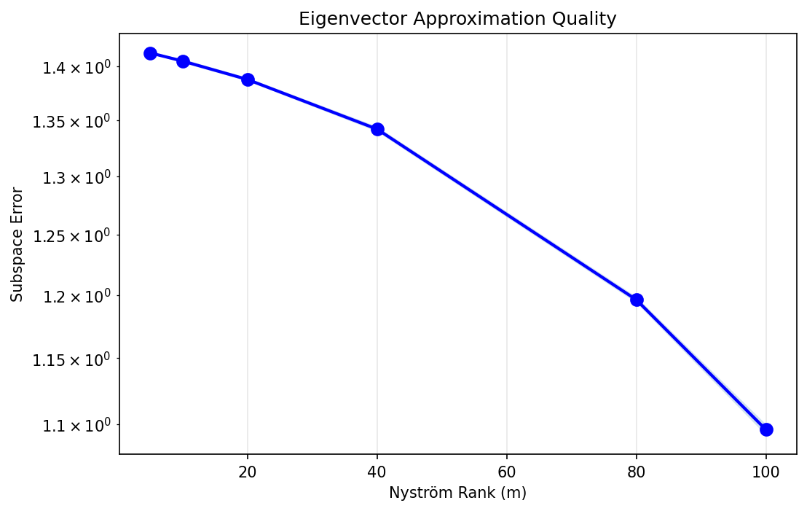
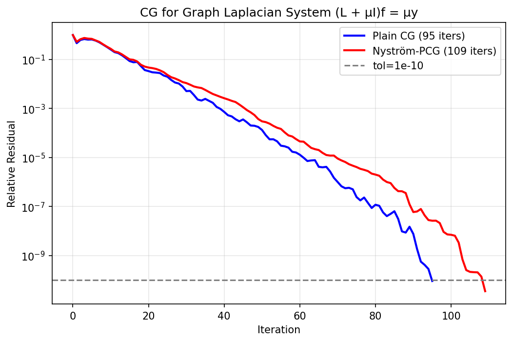

# 07 — Nyström in Graph Neural Networks

**Verdict: NO — Graph Laplacian is full-rank, Nyström doesn't help**

## Results

### Graph Laplacian Spectrum (200 nodes, 4 communities)

| Metric | Value |
|---|---|
| Nodes | 200 |
| Edges | 1,730 |
| Algebraic connectivity (λ₂) | 0.1833 |
| 90% energy at rank | **189 / 200** ← NOT low-rank |
| 99% energy at rank | 199 / 200 |


### Nyström on Graph Kernel (L+μI)⁻¹

| Rank | Error | Compression | Quality |
|---:|---:|---:|---|
| 5 | 0.9257 | 40× | Poor |
| 10 | 0.8787 | 20× | Poor |
| 20 | 0.8136 | 10× | Poor |
| 40 | 0.7269 | 5× | Poor |
| 80 | 0.6007 | 2.5× | Poor |
| 100 | 0.5404 | 2× | Poor |

**Key insight:** Even the regularized kernel is not low-rank enough for Nyström.


### Heat Kernel exp(-tL) Approximation

| Metric | Value |
|---|---|
| 90% energy at rank | 115 / 200 |
| 99% energy at rank | 184 / 200 |

| Rank | Error | Speedup |
|---:|---:|---:|
| 5 | 0.852 | 2.9× |
| 10 | 0.736 | 3.0× |
| 20 | 0.719 | 3.5× |
| 40 | 0.668 | 2.0× |
| 80 | 0.662 | 1.7× |

Errors remain above 60% even at rank 80 — spectrum doesn't decay fast enough.



### Semi-supervised Label Propagation (L+μI)f = μy

| Method | Time (ms) | Iterations | Accuracy |
|---|---:|---:|---:|
| Direct solve | 0.97 | N/A | 100% |
| Plain CG | 3.10 | 95 | 100% |
| Nyström-PCG (r=30) | 2.62 | 109 | 100% |

CG already converges well — Nyström preconditioning adds overhead (109 > 95 iters).


### CG Convergence

| Method | Iterations |
|---|---:|
| Plain CG | 95 |
| Nyström-PCG | 109 |

**Verdict: NO** — Nyström uses MORE iterations than plain CG.



### Why Nyström Fails Here

| Comparison | GP Kernel (06) | Graph Laplacian (07) |
|---|---|---|
| 90% energy rank | 4 / 300 | 189 / 200 |
| Eigenvalue decay | Exponential | Gradual |
| Nyström error (r=20) | 0.023 | 0.814 |
| **Verdict** | **Works** | **Doesn't work** |

## Files

| File | Purpose |
|---|---|
| `models.py` | graph_laplacian, SpectralGNNConv, NystromGNNConv, heat_kernel |
| `dataset.py` | Community graph, point cloud KNN graph |
| `nystrom_module.py` | laplacian_spectrum, nystrom_eigenvector_error |
| `run_gnn_benchmark.py` | Full benchmark |
| `nystrom_in_graph_neural_networks.ipynb` | Colab notebook |

```bash
python run_gnn_benchmark.py
```
