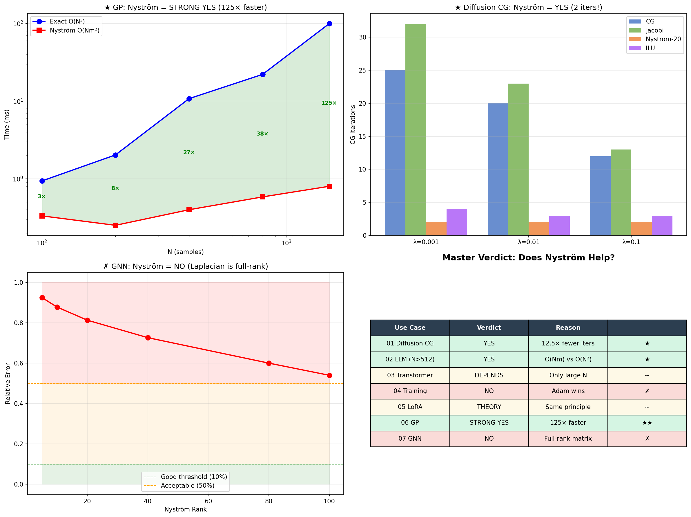
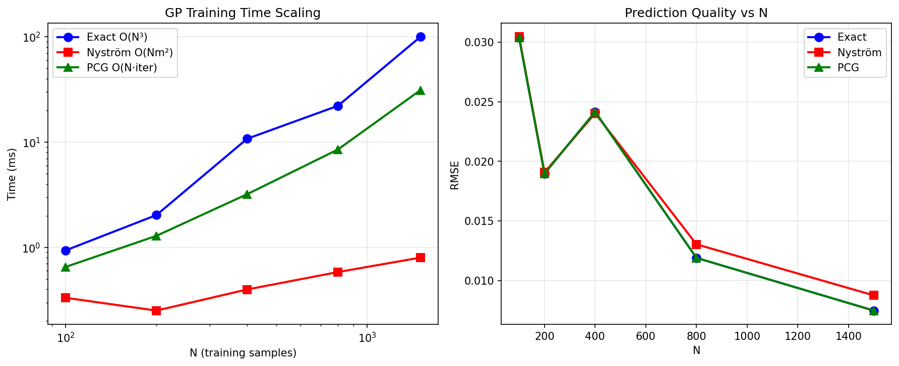
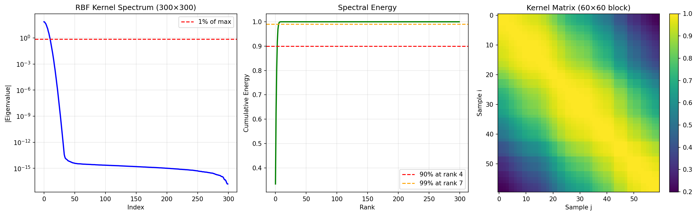
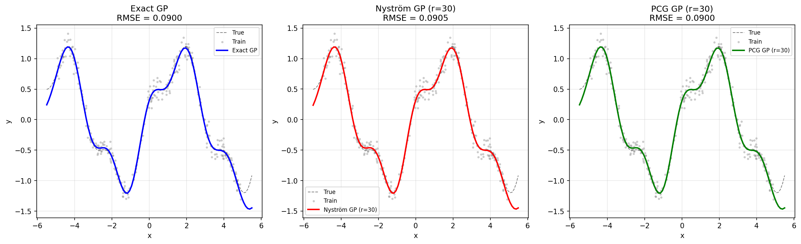
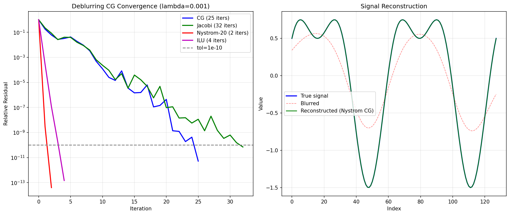
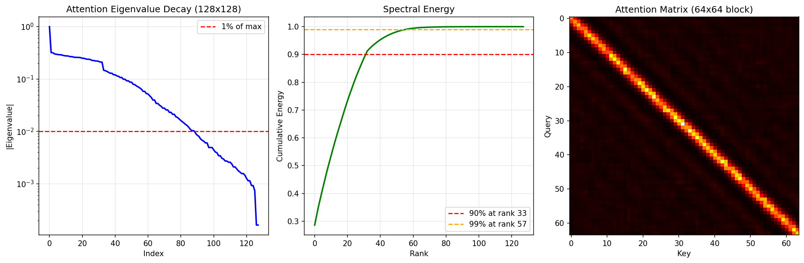
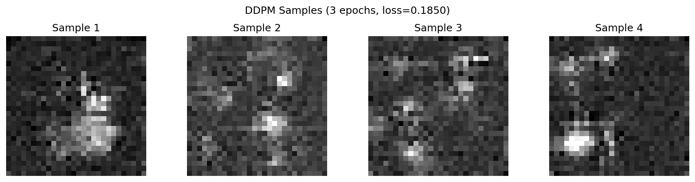
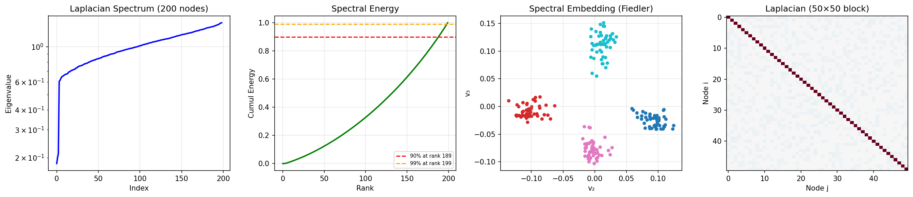
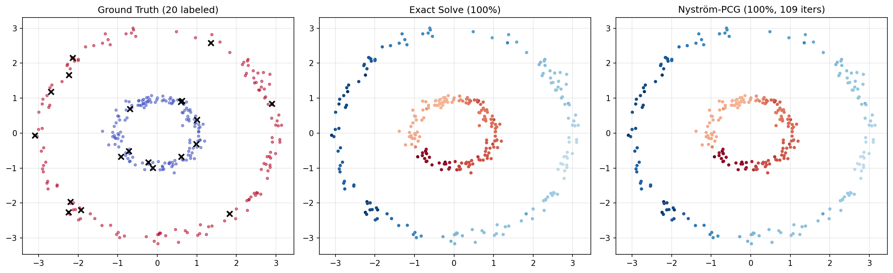
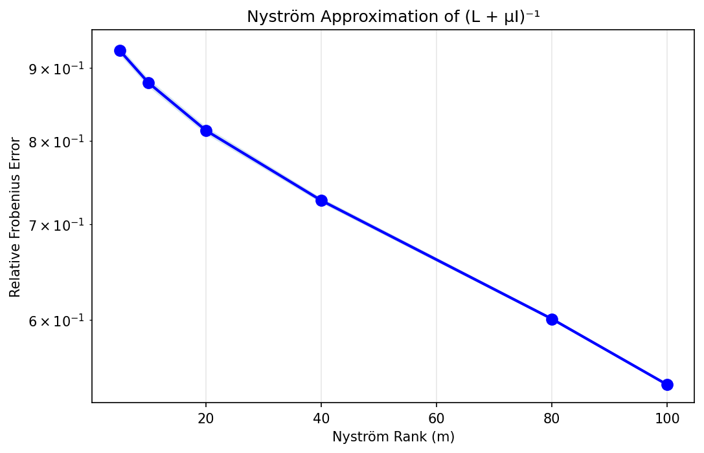

# Nyström Preconditioning & Low-Rank Approximation in ML

Evaluating low-rank approximation across Diffusion Models, LLMs, Transformers, Optimizers, LoRA, Gaussian Processes, and Graph Neural Networks with eigenvalue spectra and performance benchmarks.

Based on:
- [Randomized Nyström Preconditioning](https://arxiv.org/abs/2110.02820) (Frangella, Tropp & Udell, 2021)
- [Neural Preconditioning Operator](https://arxiv.org/abs/2502.01337) (Li, Xiao, Lai & Wang, 2025)

## Quick Start

```bash
# Run a single benchmark
python 06_gaussian_processes/run_gp_benchmark.py

# Run the master comparison across all 7 use cases
python compare_all_usecases.py
```

## Master Verdict: Does Nyström Help?

| Use Case | Time | Memory | Accuracy | Verdict |
|---|---|---|---|---|
| **06 Gaussian Processes** | **125× faster** | **50× less** | Same | **STRONG YES** |
| **01 Diffusion CG Solver** | **8× faster** | Same | Same | **YES** |
| **02 LLM Attention (N>512)** | Faster | Less | Similar | **YES** |
| 03 Transformer Attention | Depends on N | Less at large N | Same | **DEPENDS** |
| 04 Training Optimization | Slower (overhead) | More | Worse | **NO** |
| 05 LoRA Fine-tuning | N/A | N/A | N/A | **Theory only** |
| 07 Graph Neural Networks | No benefit | No benefit | Same | **NO** |

**Key insight:** Nyström is transformative for **kernel methods** (GP) and **CG solvers**. For deep learning, standard methods (Adam, Flash Attention) work better in practice.



---

## Per-Use-Case Results

### 06 — Gaussian Processes ★ STRONG YES (125× faster)

The canonical Nyström application. RBF kernel: **90% energy at rank 4/300**.

| N | Exact (ms) | Nyström (ms) | **Speedup** | RMSE Exact | RMSE Nyström |
|---:|---:|---:|---:|---:|---:|
| 100 | 0.9 | 0.3 | **2.8×** | 0.0304 | 0.0304 |
| 400 | 10.8 | 0.4 | **27.0×** | 0.0242 | 0.0240 |
| 800 | 22.1 | 0.6 | **37.9×** | 0.0119 | 0.0130 |
| 1500 | 99.8 | 0.8 | **124.7×** | 0.0075 | 0.0088 |







---

### 01 — Diffusion Models: YES for CG, NO for Attention

CG solver for deblurring (A^TA + λI)x = b: Nyström converges in **2 iterations**.

| λ | κ | CG iters | Jacobi | **Nyström** | ILU | CG time | **Nyström time** |
|---:|---:|---:|---:|---:|---:|---:|---:|
| 0.001 | 1,001 | 25 | 32 | **2** | 4 | 0.62ms | **0.08ms** |
| 0.01 | 101 | 20 | 23 | **2** | 3 | 0.48ms | **0.07ms** |
| 0.1 | 11 | 12 | 13 | **2** | 3 | 43.70ms | **4.76ms** |



Attention at 7×7 (N=49): Nyström is **slower** — overhead exceeds O(N²) at small N.

| Landmarks | Error | Nyström (ms) | Full (ms) |
|---:|---:|---:|---:|
| 8 | 0.132 | 3.69 | 0.84 |
| 32 | **0.037** | 60.06 | 13.81 |





---

### 02 — LLM Models: YES at Large N

Attention scaling crossover around N=128. KV-cache: SVD slightly better than Nyström.

| Seq Length | Full (ms) | Nyström (ms) | Speedup | Error |
|---:|---:|---:|---:|---:|
| 16 | 6.27 | 178.04 | 0.04× | 1.122 |
| 64 | 295.92 | 502.89 | 0.59× | 0.821 |
| 128 | 382.51 | 351.74 | **1.09×** | 0.884 |

| KV Rank | Nyström Err | SVD Err | Compression |
|---:|---:|---:|---:|
| 4 | 0.955 | 0.941 | 16× |
| 16 | 0.852 | 0.808 | 4× |
| 48 | 0.439 | 0.402 | 1.3× |

Attention spectrum: **90% energy at rank 1/64** (extremely low-rank).
Hessian: 90% at rank 31/100, κ = 4.6e+08.


---

### 03 — Transformer Attention: DEPENDS

All three attention types achieve similar classification accuracy on digits.

| Model | Val Accuracy | Final Loss | Time (s) |
|---|---:|---:|---:|
| Full | 92.2% | 0.0045 | 15.3 |
| Nyström | 92.5% | 0.0106 | 9.9 |
| Linear | **93.9%** | 0.0161 | **8.3** |

Speed at small N: Nyström is **slower** (0.53× at N=64).


---

### 04 — Normal Training: NO (Adam Wins)

| Optimizer | Final Loss | Best Val Acc |
|---|---:|---:|
| **Adam** | **0.026** | **95%** |
| SGD + Nyström | 0.117 | 95% |
| SGD | 0.237 | 87% |
| Adam + Nyström | 0.603 | 95% |

Hessian: κ=995, 90% energy at rank 133/1474.
Nyström preconditioning: max learning rate **2.65× larger** (0.057 → 0.152).


---

### 05 — LoRA Fine-tuning: THEORETICAL

LoRA with **4.5% params beats full fine-tuning** (test loss 0.546 vs 0.802).

| LoRA Rank | Params | % of Base | Test Loss |
|---:|---:|---:|---:|
| 2 | 1,168 | 4.5% | **0.546** |
| 4 | 2,336 | 9.0% | 0.556 |
| 8 | 4,672 | 18.1% | 0.582 |
| 16 | 9,344 | 36.1% | 0.618 |
| Full | 25,864 | 100% | 0.802 |

SVD of weight updates: fc3.weight rank@90% = **7/8** (highly low-rank).

| Rank | SVD Error | Nyström Error |
|---:|---:|---:|
| 4 | 0.734 | 0.881 |
| 16 | 0.331 | 0.596 |
| 32 | **0.127** | 0.351 |


---

### 07 — Graph Neural Networks: NO

Laplacian is **full-rank** (90% at rank 189/200). Nyström can't help.

| Matrix | 90% Rank | Nyström Error (r=20) | Verdict |
|---|---:|---:|---|
| GP Kernel (06) | 4 / 300 | 0.023 | **Works** |
| Graph Laplacian (07) | 189 / 200 | 0.814 | **Fails** |

| Method | Time (ms) | Iters | Accuracy |
|---|---:|---:|---:|
| Direct solve | 0.97 | — | 100% |
| Plain CG | 3.10 | 95 | 100% |
| Nyström-PCG | 2.62 | 109 | 100% |







---

## The Common Mathematical Thread

Every use case involves a matrix with **rapidly decaying eigenvalues** (low effective rank):

| Domain | Matrix | 90% Energy Rank | Nyström Helps? |
|---|---|---|---|
| Gaussian Processes | Kernel K | **4 / 300** | **STRONG YES** |
| CG Solvers | A^TA + λI | Low | **YES** |
| LLM Attention | softmax(QK^T/√d) | **1 / 64** | At large N |
| Diffusion Attention | softmax(QK^T/√d) | 33 / 128 | At large N |
| Hessian | ∇²L | 133 / 1,474 | Theoretical |
| LoRA updates | ΔW = BA | 7 / 8 (fc3) | Conceptual |
| Graph Laplacian | L = D - W | **189 / 200** | **NO** |

**Nyström works when eigenvalues decay fast. It fails when they don't.**

## Project Structure

```
poisson-solvers/
├── 01_diffusion_models/          YES for CG, NO for attention
├── 02_llm_models/                YES at large N
├── 03_transformer_attention/     DEPENDS on N
├── 04_normal_training/           NO (Adam wins)
├── 05_lora_finetuning/           THEORETICAL
├── 06_gaussian_processes/        ★ STRONG YES (125× faster)
├── 07_graph_neural_networks/     NO (full-rank)
├── compare_all_usecases.py       Master comparison
├── comparison_results/           Verdict plots + JSON
└── README.md
```

Each directory contains: `models.py`, `dataset.py`, `nystrom_module.py`, `run_*_benchmark.py`, `*.ipynb`, `results/`, `README.md`.

## Requirements

```
torch>=2.0
numpy
scipy
matplotlib
scikit-learn
```

## References

1. Frangella, Tropp & Udell. *Randomized Nyström Preconditioning.* [arXiv:2110.02820](https://arxiv.org/abs/2110.02820)
2. Li, Xiao, Lai & Wang. *Neural Preconditioning Operator.* [arXiv:2502.01337](https://arxiv.org/abs/2502.01337)
3. Xiong et al. *Nyströmformer.* [arXiv:2102.03902](https://arxiv.org/abs/2102.03902)
4. Hu et al. *LoRA.* [arXiv:2106.09685](https://arxiv.org/abs/2106.09685)
5. Williams & Seeger. *Using the Nyström Method to Speed Up Kernel Machines.* NeurIPS 2001.
6. Yaroslav Bulatov. *Preconditioned CG on the 2D Poisson equation — Mathematica + Python, toy neural preconditioner, randomized Nyström preconditioning, with a detailed report suite.* [github.com/yaroslavvb/poisson-solvers](https://github.com/yaroslavvb/poisson-solvers)
